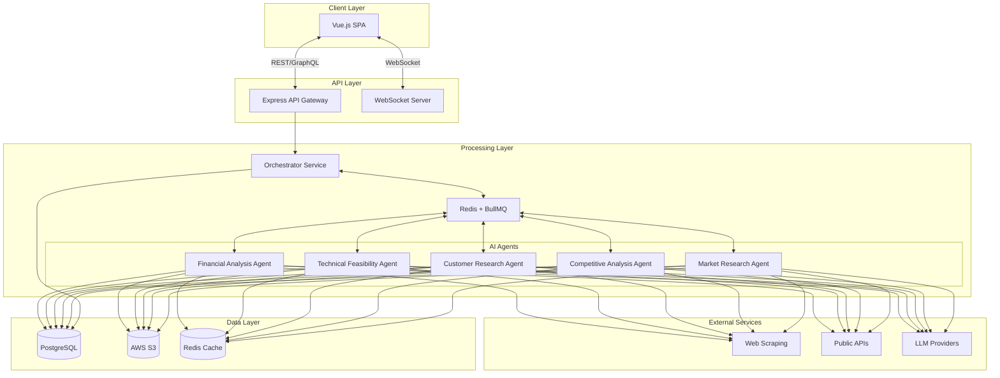

# AI-Powered Business Idea Validation Platform Architecture Document

## Introduction

This document outlines the overall project architecture for AI-Powered Business
Idea Validation Platform, including backend systems, shared services, and non-UI
specific concerns. Its primary goal is to serve as the guiding architectural
blueprint for AI-driven development, ensuring consistency and adherence to
chosen patterns and technologies.

**Relationship to Frontend Architecture:** If the project includes a significant
user interface, a separate Frontend Architecture Document will detail the
frontend-specific design and MUST be used in conjunction with this document.
Core technology stack choices documented herein (see "Tech Stack") are
definitive for the entire project, including any frontend components.

### Starter Template or Existing Project

Based on our discussion, this will be a custom setup using Vue.js with Vite,
rather than a pre-built starter template. You have an existing design system in
JSON format that will be integrated during frontend development.

### Change Log

| Date           | Version | Description          | Author              |
| -------------- | ------- | -------------------- | ------------------- |
| [Current Date] | 1.0     | Initial Architecture | Winston (Architect) |

## High Level Architecture

### Technical Summary

The system employs a microservices architecture within a monorepo, orchestrating
multiple LangChain-based AI agents through Redis/BullMQ message queues. The
Vue.js frontend communicates with a Node.js/Express API gateway via WebSockets
for real-time updates and REST for standard operations. All services are
containerized and deployed on AWS using free-tier services initially, with
PostgreSQL for structured data storage and S3 for report storage. The
architecture prioritizes cost-effectiveness for MVP while maintaining clear
scaling paths.

### Platform and Infrastructure Choice

**Platform:** AWS (Free Tier focused for MVP) **Key Services:**

- EC2 t2.micro instances (backend services)
- RDS PostgreSQL (free tier - 20GB)
- S3 (report and data storage)
- ElastiCache Redis (agent communication)
- CloudWatch (monitoring)
- API Gateway (rate limiting)

**Deployment Host and Regions:** us-east-1 (lowest cost, most services
available)

### Repository Structure

**Structure:** Monorepo with workspace management **Monorepo Tool:** npm
workspaces (built into npm 7+) **Package Organization:**

- `/packages/web` - Vue.js frontend
- `/packages/api` - Express API gateway
- `/packages/agents` - AI agent services
- `/packages/shared` - Shared types and utilities
- `/packages/infrastructure` - AWS CDK definitions

### High Level Architecture Diagram

